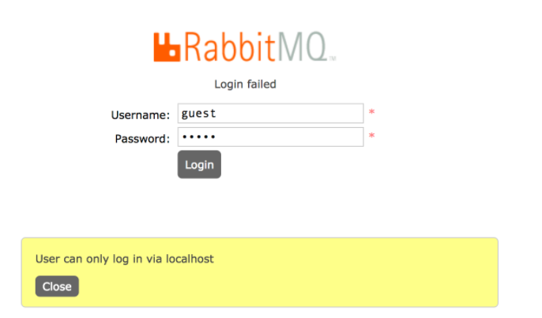

## RabbitMQ

#### User can only log in via localhost




```
找到这个文件rabbit.app
/usr/lib/rabbitmq/lib/rabbitmq_server-3.7.7/ebin/rabbit.app

将：{loopback_users, [<<”guest”>>]}，
改为：{loopback_users, []}，
原因：rabbitmq从3.3.0开始禁止使用guest/guest权限通过除localhost外的访问
```

重启服务就OK了

```
 systemctl restart rabbitmq-server.service
```

端口：5672

管理界面：15672

集群端口：25672